# MongoDB教程

## 一、MongoDB初始步骤
#### 启动  
```commandline 
mongosh
```
#### 显示数据库  
```sql
show dbs  --如果数据库中没有数据那么就不会显示
```  

#### 创建数据仓库 
```sql
use spider --创建一个叫spider的数据库
```

#### 这里show dbs是不会显示的，因为其中没有任何数据 
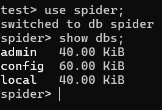  

#### 显示当前使用的数据库(在mysql中是select databses;)  
```sql
db;
```
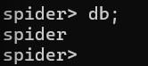

#### 删除当前数据仓库 
```sql
db.dropDatabase();
```  
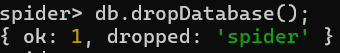   

#### 显示所有的集合(集合即为mongodb的存储形式，在mysql中是table)

```sql
show collections;
--因为我们还没有，所以什么也不显示，后面会再演示  
创建集合
db.createCollection('c1');
```
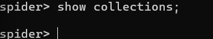  


## 二、MongoDB的增删改查

### 1. mongodb中常见的数据类型 
> Object ID: 主键ID ["_id"  :  ObjectID("56063f17ade2f21f36b03133")  ]  
> String : 字符串   
> Boolean : 布尔值     
> Integer : 数字  
> Doube : 小数  
> Arrays : 数组,类似于[1,2,3]
> Object : 文档(关联其它对象) {sname: 张三, sage: 18, class:(cccc)}
> Null : 空值 
> Timestamp : 时间戳  
> Date : 时间日期 


### 2.mongodb插入数据/文档 
```sql
-- collection_name集合名称,若不存在则会新建
db.collection_name.insert({字段:值,字段:值})
```  
示例:  
```sql
-- 创建一个名字叫c1的集合,并向其中插入数据
db.c1.insert({name:'李四',age:'18',hobby:['sleep','eat']})
```
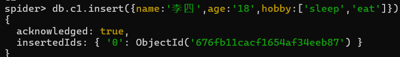
插入成功后我们再show dbs;可以发现spider数据库显示了，因为其中有数据了 
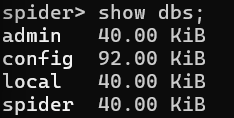    

插入多条数据:  
```sql 
db.getCollection('c1').insertMany([  
    { 
        "name":"王五",
        "hobby":["drink","game"]
    },
    { 
        "address":"河北",
        "name":"老六"
    },
  ]  
)
```  
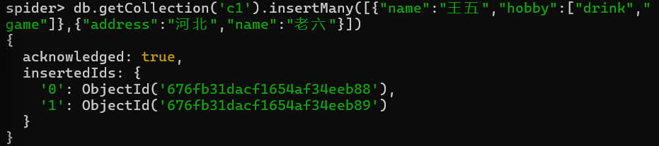  

查询插入的数据(对照与mysql的select * from 表名称) 
```sql
-- db.collection_name.find()
db.c1.find()
``` 
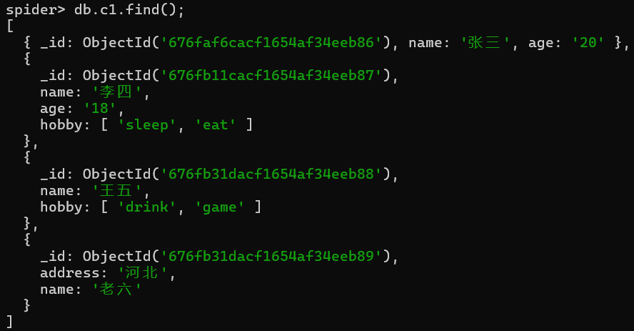  

#### 注意，可以看到是无序的   

### 3.修改数据  
#### 3.1 update更新  
```sql 
-- 注意 c1是集合名  
db.c1.update({查询条件},{待修改内容},{multi: 是否多条数据修改}) 
multi:true 表示修改满足条件的所有内容,否则只修改满足条件的第一条内容,multi不写默认为false
``` 

示例:
```sql
db.c1.update({name:"张三"},{$set:{age:18}},{multi:true}); 
```  
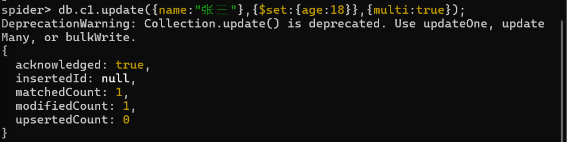  

查询发现修改成功了
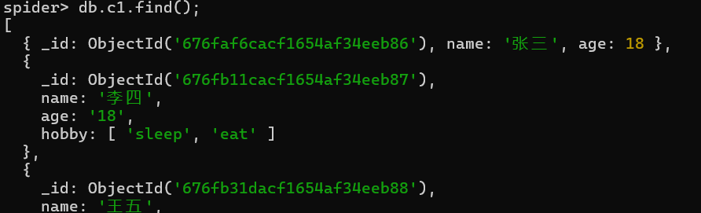
### 4.删除数据 
#### 4.1 remove()  
```sql 
db.collection_name.remove({条件},{justOne:true|false})
db.collection_name.remove()删除所有记录
db.collection_name.drop() 删除collection
``` 
示例: 
```sql
db.c2.remove({name:"Trump"}) --不写{justone} 默认为False,即删除掉所有符合条件的数据
```  
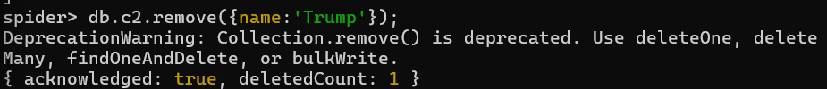  

再往c2中插入数据，用于演示删除多条数据
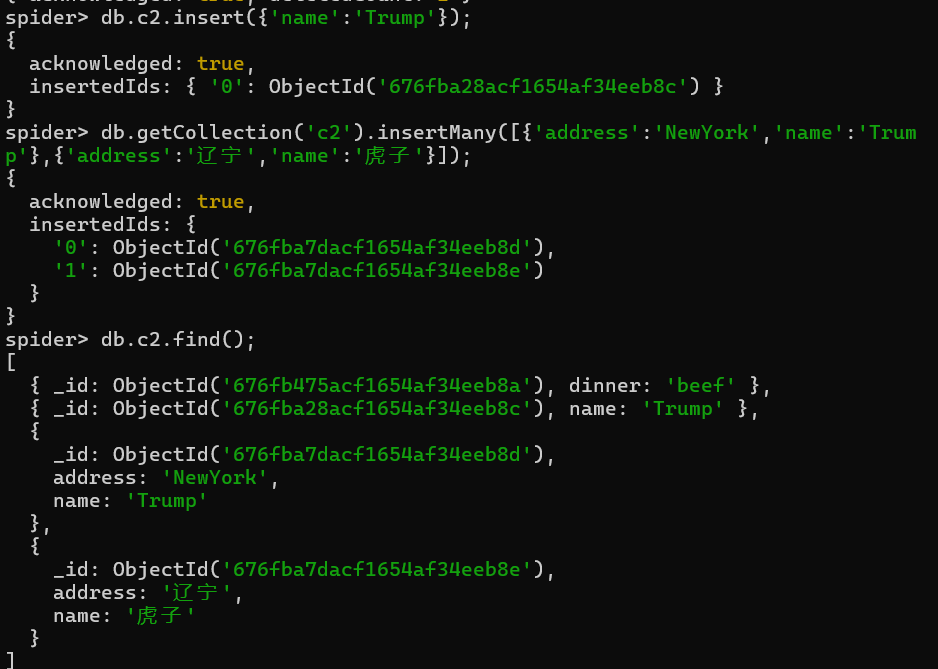 

现在表中有两条数据都有name:Trump字段，我们删除两条符合条件的数据 
```sql
db.c2.remove({name:"Trump"},{justOne:false})
```  
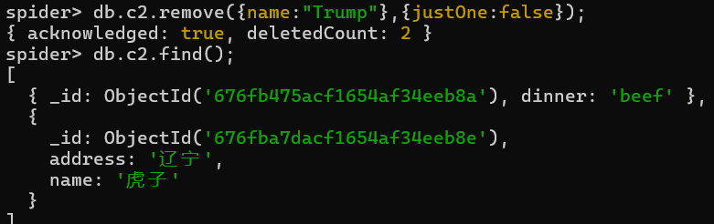 
可以看到都删掉了  


```sql
db.c2.drop() --删除整张表
```   
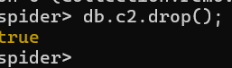  

#### 4.2 deleteOne()  
```sql
db.collection_name.deleteOne({条件})
```  
示例:
```sql
db.c1.deleteOne({name:"老六"})
```

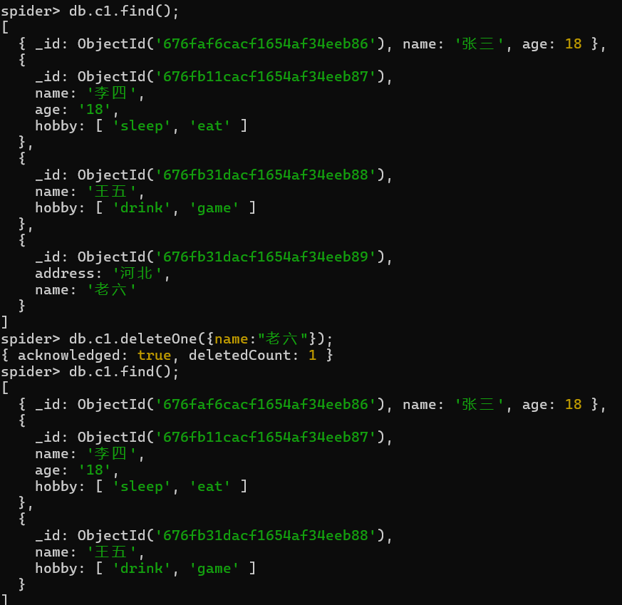