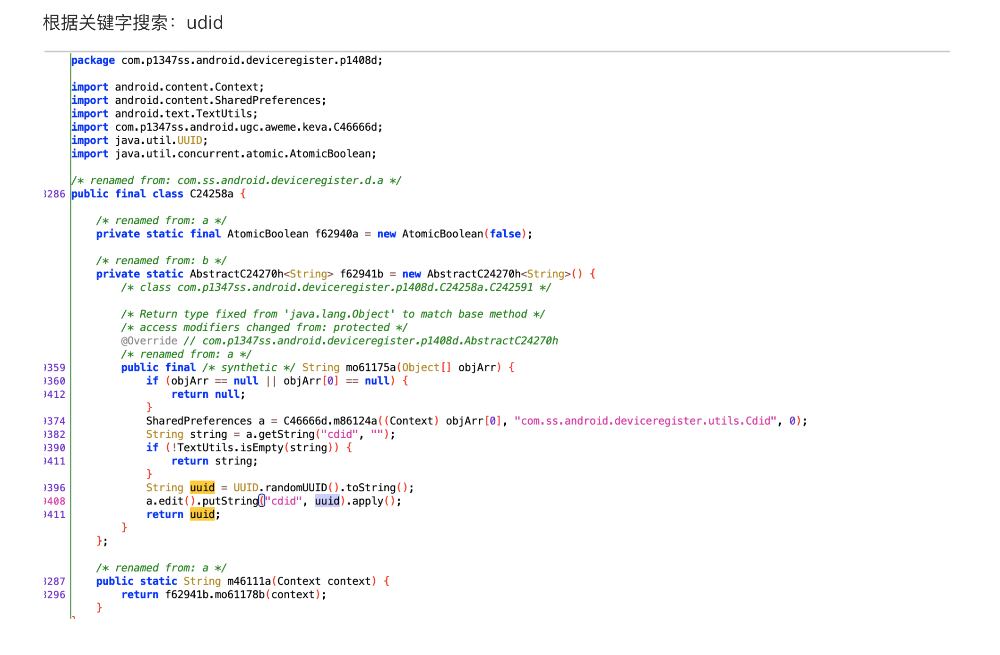
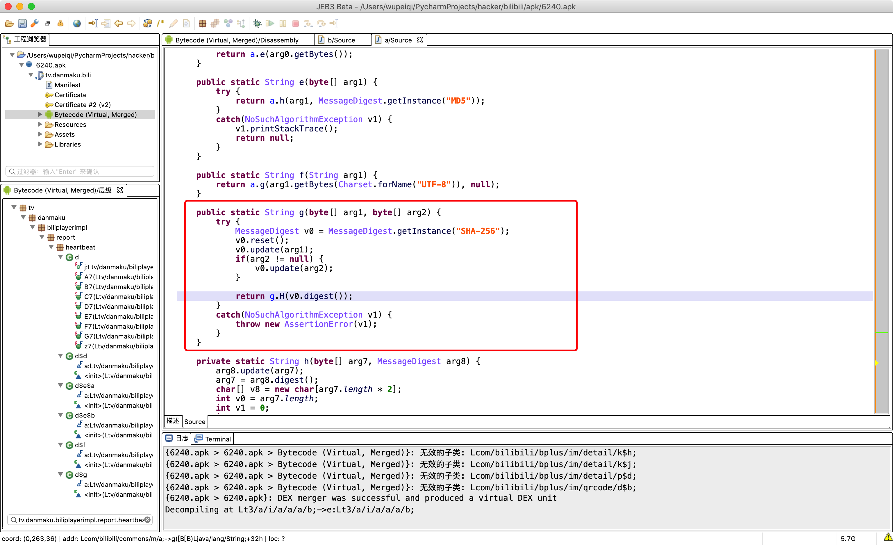
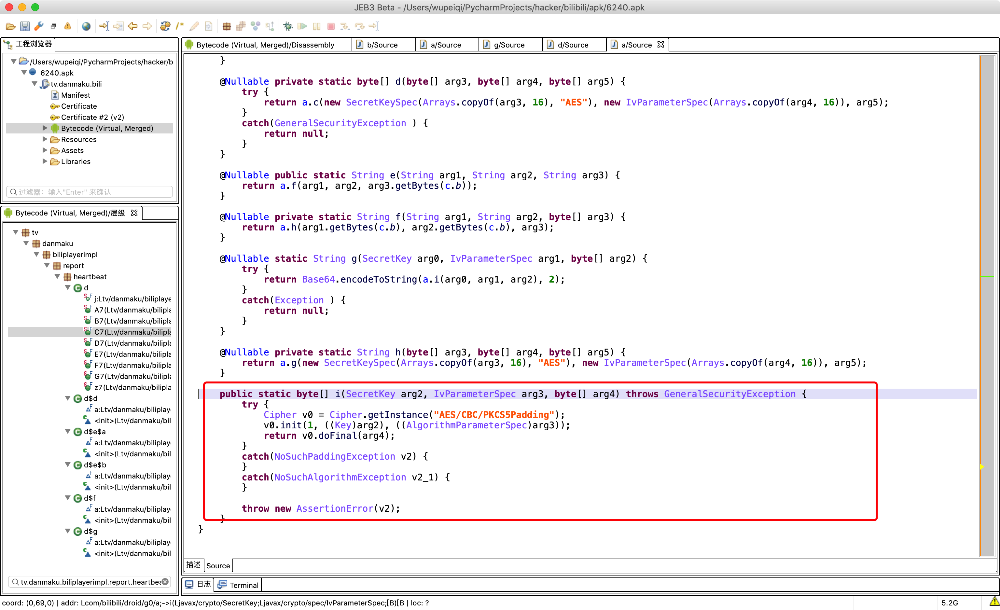
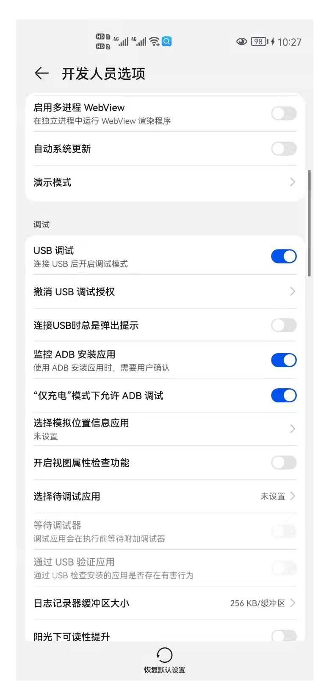

# day04 Java基础和安卓开发

今日概要：

- java常见加密（Java -> python实现 ）

- 安卓开发（基于java做安卓app开发）

  - 环境搭建
  - 快速上手

  ```
  - 看懂代码（会Java语法，能看懂）
  - 安卓开发流程（了解流程、包）
  - 安卓开发 - java代码              【逆向：apk反编译，得到java）-> 简单】
  - 安卓开发（NDK开发） - C语言写功能   【逆向：apk反编译，得到java，反编译so文件，得到C）-> 复杂】
  ```

  


## 1.Java常见加密


### 1.1 隐藏字节

```java
String salt = "xxssasdfasdfadsf";
```

```java
String v4 = new String(new byte[]{-26, -83, -90, -26, -78, -101, -23, -67, -112});
```

- 示例1：

  ```java
  String v1 = new String(new byte[]{26, 83, 90, 26, 78, 101, 23, 67, 112});
  ```

  ```python
  # 字节列表
  byte_list = [26, 83, 90, 26, 78, 101, 23, 67, 112]
  
  # 字节列表 -> python的字节数组
  bs = bytearray()
  for item in byte_list:
      bs.append(item)
      
  # python的字节数组 -> 编码 -> 字符串
  str_data = bs.decode('utf-8')
  print(str_data)
  ```

- 示例2：

  ```java
  String v4 = new String(new byte[]{-26, -83, -90, -26, -78, -101, -23, -67, -112});
  
  # java字节：有符号 -128 ~ 127
  # python：无符号  0 ~ 255
  ```

  ```python
  byte_list = [-26, -83, -90, -26, -78, -101, -23, -67, -112]
  
  bs = bytearray()  # python字节数组
  for item in byte_list:
      if item < 0:
          item = item + 256
      bs.append(item)
  
  str_data = bs.decode('utf-8')  # data = bytes(bs)
  print(str_data)
  ```

  

```
注意事项：什么编码？（utf-8)
	String v4 = new String(new byte[]{-26, -83, -90, -26, -78, -101, -23, -67, -112});
```

```python
# 类似于Java中的字节数组
data = "张三懵逼了"
data_bytes = data.encode('utf-8')


data_list = bytearray()
for item in data_bytes:
    data_list.append(item)

res = data_list.decode('utf-8')
print(res)
```


提醒：MD5加密盐、AES加密key、iv;


### 1.2 uuid

抖音udid



```java
import java.util.UUID;

public class Hello {

    public static void main(String[] args){
        String uid = UUID.randomUUID().toString();
        System.out.println(uid);
    }
}
```

```python
import uuid

uid = str(uuid.uuid4())
print(uid)
```

```
29cd5f50-4b4c-457b-9a59-33a12e3edd10
```

```
看到 29cd5f50-4b4c-457b-9a59-33a12e3edd10 ？动态的吗？

- 第一种：每次请求生成UUID，抓包，每次都不一样 --> 直接伪造。

- 第二种：
	- 在app刚启动，偷偷向后端发送请求，返回uuid，手机的凭证
	- app写入到本地文件 xxx.xml
	- 点击功能，发送请求 + 找到文件uuid -> 发送过去

	现象：
		- 抓包uuid固定
		- app清楚数据 & 卸载安装 -> uuid会变

	思路：
		- 直接用固定的uuid
		- 动态生成是否能用？
		- 过程模拟
			- 启动请求，获取uuid
			- 发送请求携带
```


### 1.3 随机值

抖音：openudid


```java
import java.math.BigInteger;
import java.security.SecureRandom;

public class Hello {

    public static void main(String[] args) {
        // 随机生成80位，10个字节
        BigInteger v4 = new BigInteger(80, new SecureRandom());
        // 让字节以16进制展示
        String res = v4.toString(16);
        System.out.println(res);

    }
}
```

```python
import random

data = random.randbytes(10)  # pytho3.9

ele_list = []
for item in data:
    # 184    十进制  -> 十六进制
    # hex(item)  # 
    ele = hex(item)[2:]
res = "".join(ele_list)
print(res)
```

```python
data = "".join([ hex(item)[2:] for item in random.randbytes(10)])
```


#### 小补充：十六进制

```python
import random

data = random.randbytes(10)  # pytho3.9

ele_list = []
for item in data:
    ele = hex(item)[2:].rjust(2,"0")
res = "".join(ele_list)
print(res)
```

```python
data = "".join([ hex(item)[2:].rjust(2,"0") for item in random.randbytes(10)])
```


转换十六进制字符串：

- 内置函数

  ```
  v1 = hex(199)
  
  '0xc7'
  ```

- 字符串格式化

  ```
  v2 = "%x" %(199,)
  
  'c7'
  ```

  ```python
  v3 = "%02x" %(5,)
  
  '05'
  ```


```python
import random

data = random.randbytes(10)

ele_list = []
for item in data:
    ele = "%02x" %(item,)
    ele_list.append(ele)

res = "".join(ele_list)
print(res)

open_udid = "".join(["%02x" % i for i in random.randbytes(10)])
print(open_udid)
```


### 1.4 时间戳

抖音：_ticket


```java
public class Hello {

    public static void main(String[] args) {
        String t1 = String.valueOf(System.currentTimeMillis() / 1000);
        String t2 = String.valueOf(System.currentTimeMillis());

        System.out.println(t1);
        System.out.println(t2);
    }
}
```

```python
import time

v1 = int(time.time())
v2 = int(time.time()*1000)
```

```
v1 = str(int(time.time()))
v2 = str(int(time.time()*1000))
```

```
注意事项：
	1.时间戳requests请求中
		requests.post(
			...
			headers={
				"x1": "字符串"
			}
		)

	2.作用是什么？
		- 有意义的时间
			- 点击时间，日志请求。
			- 播放、运行、操作时间。
		- 加密规则，构造动态的字符串
			xxxx/xxxx/xxx?sign=fsdfksdjkfskdj

			- 在app中（例如：登录输入手机号）
				手机号+1651928998 => md5加密 xxkfsdf
				xxxx/xxxx/xxx?sign=xxkfsdf&ts=1651928998
				
			- 接收请求
				xxxx/xxxx/xxx?sign=xxkfsdf&ts=1651928998
				sign=xxkfsdf
				ts=1651928998

				手机号+1651928998 => md5加密  ==> 密文与sign比较
```


### 1.5 十六进制的字符串


在Java中字节是有符号：-128 ~ 127 

```python
# name_bytes = "武沛齐".encode('utf-8')
name_bytes = [10, -26, -83, -90, -26, -78, -101, -23, -67, -112]

data_list = []

for item in name_bytes:
    item = item & 0xff   # item<0时，让item+256
    ele = "%02x" % item
    data_list.append(ele)
    
print("".join(data_list))
```


### 1.6 md5加密

```python
import hashlib

obj = hashlib.md5()
obj.update('xxxxx'.encode('utf-8'))

# java中没有这个功能。
v1 = obj.hexdigest()
print(v1) # fb0e22c79ac75679e9881e6ba183b354

v2 = obj.digest()
print(v2) # b'\xfb\x0e"\xc7\x9a\xc7Vy\xe9\x88\x1ek\xa1\x83\xb3T'
```


抖音：X-SS-STUB

```
每次发送POST请求时，抖音都会携带一些请求头：
	X-SS-STUB = "fjaku9asdf"

读取请求体中的数据，对请求体中的数据进行md5加密。
```


```java
import java.security.MessageDigest;
import java.security.NoSuchAlgorithmException;
import java.util.Arrays;
import java.util.Base64;

public class Hello {

    public static void main(String[] args) throws NoSuchAlgorithmException {
        String name = "武沛齐";
        
        MessageDigest instance = MessageDigest.getInstance("MD5");
        byte[] nameBytes = instance.digest(name.getBytes());
        // System.out.println(Arrays.toString(nameBytes));

        // String res = new String(nameBytes);
        // System.out.println(res);

        // 十六进制展示
        StringBuilder sb = new StringBuilder();
        for(int i=0;i<nameBytes.length;i++){
            int val = nameBytes[i] & 255;  // 负数转换为正数
            if (val<16){
                sb.append("0");
            }
            sb.append(Integer.toHexString(val));
        }
        String hexData = sb.toString();
        System.out.println(hexData); // e6ada6e6b29be9bd90
    }
}
```

```python
import hashlib

m = hashlib.md5()
m.update("武沛齐".encode("utf-8"))

v1 = m.digest()
print(v1) # b'\x175\x10\x12G$)\xd5-\x0c\r#\xd4h\x17='

v2 = m.hexdigest()
print(v2) # 17351012472429d52d0c0d23d468173d
```


关于加盐：

```java
import java.security.MessageDigest;
import java.security.NoSuchAlgorithmException;
import java.util.Arrays;
import java.util.Base64;

public class Hello {

    public static void main(String[] args) throws NoSuchAlgorithmException {
        String name = "武沛齐";
        MessageDigest instance = MessageDigest.getInstance("MD5");
        instance.update("xxxxxx".getBytes());
        
        byte[] nameBytes = instance.digest(name.getBytes());
        
        System.out.println(Arrays.toString(nameBytes));

        String res = new String(nameBytes);
        System.out.println(res);

        // 十六进制展示
        StringBuilder sb = new StringBuilder();
        for(int i=0;i<nameBytes.length;i++){
            int val = nameBytes[i] & 255;  // 负数转换为正数
            if (val<16){
                sb.append("0");
            }
            sb.append(Integer.toHexString(val));
        }
        String hexData = sb.toString();
        System.out.println(hexData); // e6ada6e6b29be9bd90
    }
}
```


```java
import hashlib

m = hashlib.md5("xxxxxx".encode('utf-8'))
m.update("武沛齐".encode("utf-8"))

v2 = m.hexdigest()
print(v2) # 17351012472429d52d0c0d23d468173d
```


```
md5加密，基本上每个app都有。
	- 32位动态的值   fb0e22c79ac75679e9881e6ba183b354
	- 变大小和变小写
	- 找盐
	- 关键就是找明文，明文构造
		- 读取请求头/请求体/url 数据，某个字段
		- 读取数据拼接字符串
			name=wupeiqi&age=19&size=20
			namewupeiqiage19size20
			固定值namewupeiqiage19size20固定值

	- 密文的再次操作
		fb0e22c79ac75679e9881e6ba183b354
		fb0e22c79ac75679e9881e6ba183b35405a

超前的小知识：
	给你apk文件，反编译Java代码，关键字定位代码位置。

	看到长度是动态32位字符串，猜测应该用了md5加密 -> 验证码（Hook机制）
		MessageDigest.getInstance -> 替换咱们自己的函数

		function getInstance(arg){
			if(arg=="MD5"){
				console.log("用到md5加密");
				console.log(输入调用栈);
			}
		}
```


### 1.7 sha-256加密

B站：x/report/andriod2，请求体




```java
import java.security.MessageDigest;
import java.security.NoSuchAlgorithmException;
import java.util.Arrays;
import java.util.Base64;

public class Hello {

    public static void main(String[] args) throws NoSuchAlgorithmException {
        String name = "武沛齐";
        MessageDigest instance = MessageDigest.getInstance("SHA-256");
        byte[] nameBytes = instance.digest(name.getBytes());
        // System.out.println(Arrays.toString(nameBytes));

        // String res = new String(nameBytes);
        // System.out.println(res);

        // 十六进制展示
        StringBuilder sb = new StringBuilder();
        for(int i=0;i<nameBytes.length;i++){
            int val = nameBytes[i] & 255;  // 负数转换为正数
            if (val<16){
                sb.append("0");
            }
            sb.append(Integer.toHexString(val));
        }
        String hexData = sb.toString();
        System.out.println(hexData); // e6ada6e6b29be9bd90
    }
}
```

```python
import hashlib

m = hashlib.sha256()
m.update("武沛齐".encode("utf-8"))

v2 = m.hexdigest()
print(v2)
```


### 1.8 AES加密

对称加密

- key & iv ，明文加密。【app端】
- key & iv ，解密。【API】

```
情况A: 请求体密文（抓包乱码）
情况B: sign，AES加密+base64编码
```

刷B站播放时，发送POST请求。

AES加密（请求体中的数据） -> 密文（JS央视频 key & iv & 加密）。




```java
import javax.crypto.BadPaddingException;
import javax.crypto.Cipher;
import javax.crypto.IllegalBlockSizeException;
import javax.crypto.NoSuchPaddingException;
import javax.crypto.spec.IvParameterSpec;
import javax.crypto.spec.SecretKeySpec;
import java.io.UnsupportedEncodingException;
import java.security.InvalidAlgorithmParameterException;
import java.security.InvalidKeyException;
import java.security.MessageDigest;
import java.security.NoSuchAlgorithmException;
import java.util.Arrays;
import java.util.Base64;

public class Hello {

    public static void main(String[] args) throws Exception {
        String data = "武沛齐";
        String key = "fd6b639dbcff0c2a1b03b389ec763c4b";
        String iv = "77b07a672d57d64c";

        // 加密
        byte[] raw = key.getBytes();
        SecretKeySpec skeySpec = new SecretKeySpec(raw, "AES");
        IvParameterSpec ivSpec = new IvParameterSpec(iv.getBytes());
        
        Cipher cipher = Cipher.getInstance("AES/CBC/PKCS5Padding");
        cipher.init(Cipher.ENCRYPT_MODE, skeySpec, ivSpec);
        byte[] encrypted = cipher.doFinal(data.getBytes());
        
        // System.out.println(Arrays.toString(encrypted));
        
    }
}
```

```python
# pip install pycryptodome
from Crypto.Cipher import AES
from Crypto.Util.Padding import pad

KEY = "fd6b639dbcff0c2a1b03b389ec763c4b"
IV = "77b07a672d57d64c"


def aes_encrypt(data_string):
    aes = AES.new(
        key=KEY.encode('utf-8'),
        mode=AES.MODE_CBC,
        iv=IV.encode('utf-8')
    )
    raw = pad(data_string.encode('utf-8'), 16)
    return aes.encrypt(raw)

data = aes_encrypt("武沛齐")
print(data)
print([ i for i in data])

```


### 1.9 gzip压缩

抖音注册设备：设备。

> 注册设备：生成一些值，值中包括：   （cdid、手机型号、手机品牌....） 后端读取到时候，发现cdid是一个全新的请求。那么抖音就会生成 `device_id、install_id、tt`

```
（cdid、手机型号、手机品牌....） --> gzip压缩(字节)  --> 加密   -->   密文
```


```java
import java.io.ByteArrayInputStream;
import java.io.ByteArrayOutputStream;
import java.io.IOException;
import java.math.BigInteger;
import java.security.SecureRandom;
import java.util.ArrayList;
import java.util.Arrays;
import java.util.HashMap;
import java.io.OutputStream;
import java.util.zip.GZIPInputStream;
import java.util.zip.GZIPOutputStream;

public class Hello {

    public static void main(String[] args) throws IOException {

        // 压缩
        String data = "武沛齐";
        // System.out.println(Arrays.toString(data.getBytes()));
        ByteArrayOutputStream v0_1 = new ByteArrayOutputStream();
        GZIPOutputStream v1 = new GZIPOutputStream((v0_1));
        v1.write(data.getBytes());
        v1.close();
        
        byte[] arg6 = v0_1.toByteArray();  //gzip压缩后：arg6
        // System.out.println(Arrays.toString(arg6));

        // 解压缩
        ByteArrayOutputStream out = new ByteArrayOutputStream();
        ByteArrayInputStream in = new ByteArrayInputStream(arg6);
        GZIPInputStream ungzip = new GZIPInputStream(in);
        byte[] buffer = new byte[256];
        int n;
        while ((n = ungzip.read(buffer)) >= 0) {
            out.write(buffer, 0, n);
        }
        byte[] res = out.toByteArray();
        // System.out.println(Arrays.toString(res));
        System.out.println(out.toString("UTF-8"));

    }
}
```

```python
import gzip


# 压缩
"""
s_in = "我是武沛齐".encode('utf-8')
s_out = gzip.compress(s_in)

print([i for i in s_out])
"""

# 解压缩
"""
res = gzip.decompress(s_out)
print(res)
print(res.decode('utf-8'))
"""
```

提醒：java、Python语言区别。（个人字节是不同，不影响整个的结果），。 


### 1.10 base64

```java
import java.util.Base64;

public class Hello {

    public static void main(String[] args) {
        String name = "武沛齐";
        // 加密
        Base64.Encoder encoder  = Base64.getEncoder();
        String res = encoder.encodeToString(name.getBytes());
        System.out.println(res); // "5q2m5rKb6b2Q"
		
        // 解密
        Base64.Decoder decoder  = Base64.getDecoder();
        byte[] origin = decoder.decode(res);
        String data = new String(origin);
        System.out.println(data); // 武沛齐

    }
}
```

```python
import base64

name = "武沛齐"

res = base64.b64encode(name.encode('utf-8'))
print(res) # b'5q2m5rKb6b2Q'


data = base64.b64decode(res)
origin = data.decode('utf-8')
print(origin) # "武沛齐"
```


## 2.安卓开发（环境搭建）

目标：了解正向开发常见流程（逆向）。

想要开发安卓程序：

- Java语言 + JDK
- 安卓的工具（SDK）+ 类库
- IDE - android studio


### 2.1 环境搭建

本质上：

- 安装andriod SDK
- android studio（内部可以帮助你安装andriod SDK）


#### 2.2.1 下载和安装

https://developer.android.google.cn/studio/archive.html


#### 2.2.2 启动 android studio


电脑未安装android SDK。


点击【Cancel】


注意：点击next之后，展开详细，里面可以看到两个路径。

- Android SDK路径：C:\Users\Administrator\AppData\Local\Android\Sdk

- JDK/JRE路径：安装


-----

- 慢，网络下载。
- 报错，虚拟


#### 2.2.3 配置环境变量

在电脑上安装Android：C:\Users\Administrator\AppData\Local\Android\Sdk


需要将如下两个目录加入到环境变量：

```
C:\Users\Administrator\AppData\Local\Android\Sdk\tools
C:\Users\Administrator\AppData\Local\Android\Sdk\platform-tools
```

把这两个目录加入到系统环境变量。

> 后期就可以在终端上执行执行命令，去调用adb。


#### 2.2.5 先配置


#### 2.2.6 创建项目


#### 2.2.9 设备（真机）

本质：

- 手机连接到电脑（授权）
- app安装到手机上
- 手机上去运行和查看


##### 第一步：开发者模式 

手机开启开发者模式 & USB调试，并且用数据线和电脑连接。

当你一插线，手机上会提示授权。




##### 第二步：检查和处理，电脑未正常运行adb【电脑】

打开终端，启动adb并查看现在连接的设备有哪些？

```
>>>adb kill-server
>>>adb start-server    注意：启动后手机数据线最好重新插入
>>>adb devices
```


##### 第三步：运行


去启动：

- 设备启动
- 将你的编写app安装到设备
- 在设备上自动打开


如果点击运行出现：build-tools-32.0.rc 。。。...


## 总结

- 安装并运行app

  ```
  - 真机
  - AndroidStudio手机模拟器 (看2期，点点点操作)
  - mumu模拟器
  ```

- 安卓开发


