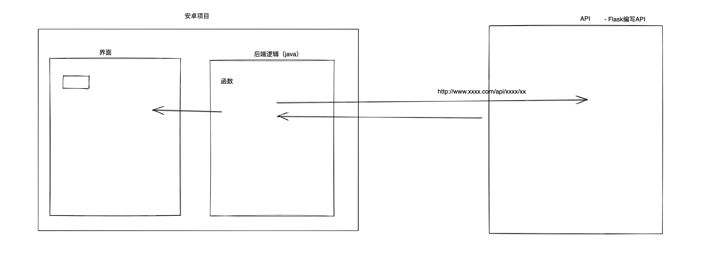
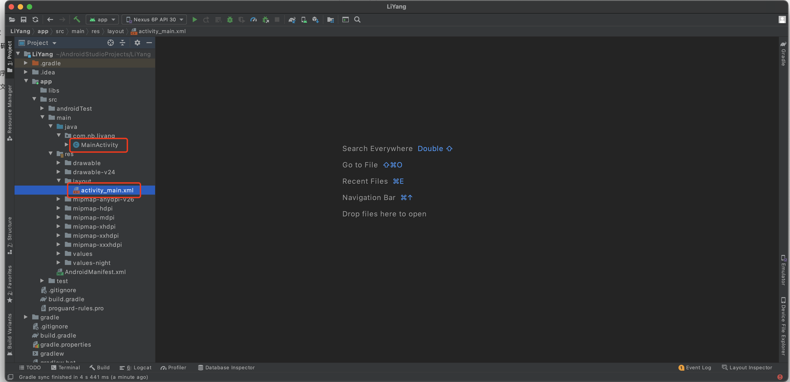

# day05 安卓开发

今日目标：快速开发一个安卓页面（用户登录&跳转）

今日概要：

- 安卓UI和后台逻辑
- 网络请求
- 序列化和反序列化
- 保存XML文件（cookie）


## 1.UI和逻辑代码

- 设计页面（布局、大小、位置）
- Java逻辑代码






## 2.网络请求

okhttp

```
1.引入，在build.gradle中 implementation "com.squareup.okhttp3:okhttp:4.9.1"
2.配置，在AndroidManifest.xml中 <uses-permission android:name="android.permission.INTERNET"/>
	只能发送https请求。
3.支持http（仅测试使用）
```


发送POST请求

```
user=wupeiqi&age=99&size18
```

```java
new Thread() {
    @Override
    public void run() {
        OkHttpClient client = new OkHttpClient();
        
        FormBody form = new FormBody.Builder()
                .add("user", dataMap.get("username"))
                .add("pwd", dataMap.get("password"))
                .add("sign", dataMap.get("sign")).build();

        Request req = new Request.Builder().url("http://192.168.0.6:9999/login").post(form).build();
        Call call = client.newCall(req);
        try {
            Response res = call.execute();
            ResponseBody body = res.body();
            // 字符串={"status": true, "token": "fffk91234ksdujsdsd", "name": "武沛齐"}
            String dataString = body.string();

            // 对字符串进行反序列化，获取成对象。
            HttpResponse context = new Gson().fromJson(dataString, HttpResponse.class);

            // 将用户token和信息保存到特殊XML文件（写入）
            SharedPreferences sp = getSharedPreferences("sp_mds", MODE_PRIVATE);
            SharedPreferences.Editor editor = sp.edit();
            editor.putString("token", context.token);
            editor.commit();

            // 跳转到其他页面 IndexActivity
            Intent in = new Intent(mContext, IndexActivity.class);
            startActivity(in);

            // Log.e("MDS", "请求成功获取返回值=" + dataString);
        } catch (IOException ex) {
            Log.e("MDS", "网络请求错误");
        }
    }
}.start();
```


