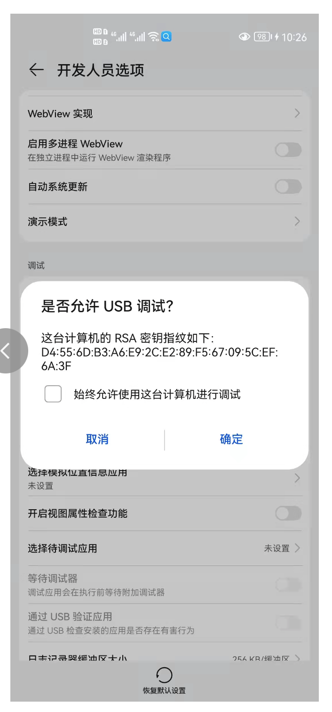
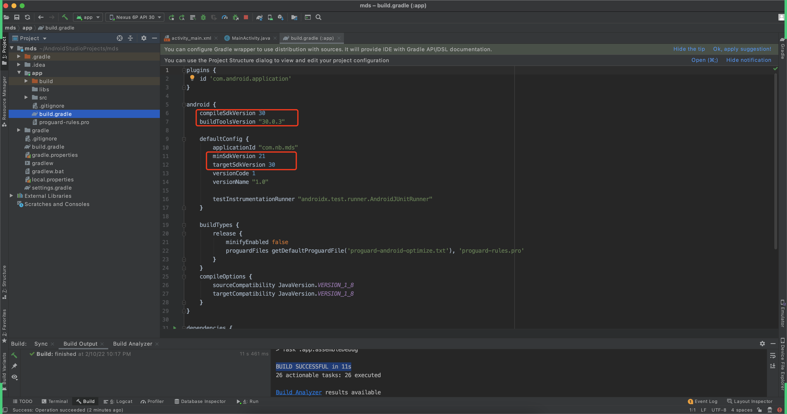

# 环境搭建-详细版

在安装和操作之前，建议提前开始电脑的vt-x，虚拟机开启：


## 1.安装android studio

https://developer.android.google.cn/studio/archive.html


## 2.启动和配置


如果电脑已开启VT-X，安装显示：


如果电脑未开启VT-X，安装显示（没关系，可继续操作）：

```
没关系，可以继续操作。
vt-x，用于电脑上创建虚拟设备 or 模拟器，如果没有的话，可以用真机来进行开发测试。
```


会发现：

- platform-tools有
- tools目录没有


## 3.新建项目


## 4.环境变量

打开SDK安装目录，将以下两个目录添加到环境变量：


## 5.运行项目

### 5.1 真机（建议）

手机开启开发者模式 & USB调试，并且用数据线和电脑连接。


当你一插线，手机上会提示授权。





稍等片刻，此时在android studio中会读取到你的手机设备。


如果没有读取到，请在手机上【撤销USB调试授权】，然后再重新插入USB，重新授权。


当读取到设备之后，可以点击运行（第一次慢）：

- 在手机上安装app
- 运行app


### 5.2 模拟器

在 网易mumu 或 雷电模拟器 上去运行我们自己开发的APP。

> 模拟器启动起来之后，android studio会自动连接并读取到模拟器设备。


如果读取不到，请在终端重启adb，以便于读取到设备列表。


如果没有找到设备，可以重新执行命令：

```
adb kill-server
adb start-server
```


**特殊的**，在win系统上，mumu模拟器可能无法读取到设备，此时可以执行adb命令连接：

```
adb connect 127.0.0.1:7555
```

然后，就可以连接上模拟器。


**当读取到设备之后，可以点击运行（第一次慢）：**

- 在手机上安装app
- 运行app


### 5.3 虚拟设备（不建议）


如果在安装的过程中有自定义过相关sdk的目录（或含中文路径），可能会出现这个报错：

```
The emulator process for AVD Nexus_6_API_29 has terminated.
```


接下来需要做：

- 删除设备
- 修改环境变量，将虚拟设备安装到其他的目录，例如：`C:\AndroidAVD`

新建环境变量，然后重启android studio，再去创建设备，设备就在此目录了，这样就可以


## 6.关于报错

如果点击运行出现：build-tools-32.0.rc 。。。...




强调：没必要换成最新版。


