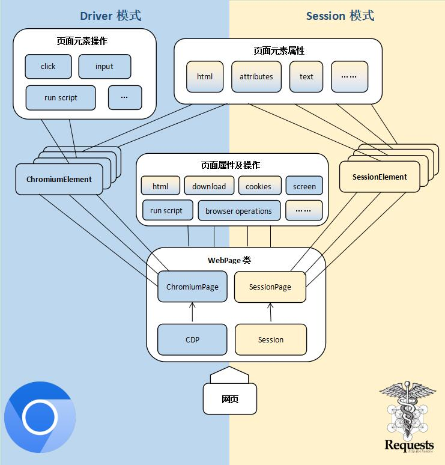

 

`WebPage`对象整合了`SessionPage`和`ChromiumPage`，实现了两者之间的互通。

它既可以操控浏览器，也可以收发数据包，并且会在两者之间同步登录信息。

它有 d 和 s 两种模式，分别对应操控浏览器和收发数据包。

`WebPage`可灵活的在两种模式间切换，从而实现一些有趣的用法。

比如，网站登录代码非常复杂，用数据包实现过于烧脑，我们可以用浏览器处理登录，再通过切换模式用收发数据包的方式去采集数据。

两种模式的使用逻辑是一致的，跟`ChromiumPage`没有区别，易于上手。

`WebPage`结构图：

