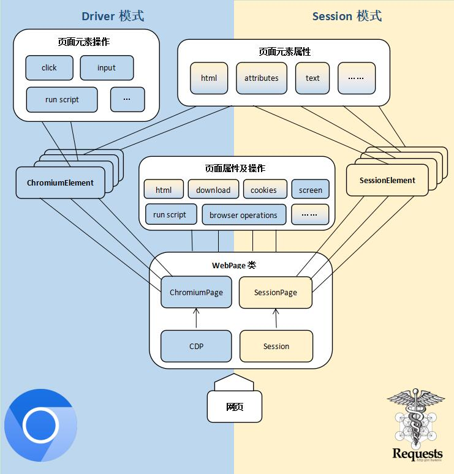

<div class="wwads-cn wwads-horizontal" data-id="317"></div><br/>

本节讲解 DrissionPage 的一些基本概念。了解它大概的构成。

如果您觉得有点懵，可直接跳过本节。

## ✅️️ 网页自动化

网页自动化的形式通常有两种，它们各有优劣：

- 直接向服务器发送数据包，获取需要的数据
- 控制浏览器跟网页进行交互

前者轻量级，速度快，便于多线程、分布式部署，如 requests 库。但当数据包构成复杂，甚至加入加密技术时，开发过程烧脑程度直线上升。

鉴于此，DrissionPage 以页面为单位将两者整合，对 Chromium 协议 和 requests 进行了重新封装，实现两种模式的互通，并加入常用的页面和元素控制功能，可大幅降低开发难度和代码量。  
用于操作浏览器的对象叫 Driver，requests 用于管理连接的对象叫 Session，Drission 就是它们两者的合体。Page 表示以 POM 模式封装。
在旧版本，本库是通过对 selenium 和 requests 的重新封装实现的。  
从 3.0 版开始，作者另起炉灶，用 chromium 协议自行实现了 selenium 全部功能，从而摆脱了对 selenium 的依赖，功能更多更强，运行效率更高，开发更灵活。

如果您想了解旧版，请查阅“旧版使用方法”章节。

--- 

## ✅️️ 基本使用逻辑

无论是控制浏览器，还是收发数据包，其操作逻辑是一致的。

即先创建页面对象，然后从页面对象中获取元素对象，通过对元素对象的读取或操作，实现数据的获取或页面的控制。

因此，最主要的对象就是两种：页面对象，及其生成的元素对象。

---

## ✅️️ 主要对象

主页面对象有 3 种，它们通常是程序的入口：

- `ChromiumPage`：单纯用于操作浏览器的页面对象
- `WebPage`：整合浏览器控制和收发数据包于一体的页面对象
- `SessionPage`：单纯用于收发数据包的页面对象

衍生物：

- `ChromiumTab`：`ChromiumPage`生成的标签页对象
- `MixTab`：`WebPage`生成的标签页对象
- `ChromiumFrame`：`<iframe>`元素对象
- `ChromiumElement`：浏览器元素对象
- `SessionElement`：静态元素对象
- `ShadowRoot`：shadow-root 元素对象

### 📌 称呼

文档里经常用到这几个称呼：

- `ChromiumPage`、`WebPage`统称为 Page 对象
- `ChromiumTab`、`MixTab`统称为 Tab 对象
- Page 对象、Tab 对象和`ChromiumFrame`统称为页面对象

---

### 📌 `ChromiumPage`

`ChromiumPage`是用于操作浏览器的页面对象，它仅用于操作浏览器，而不能收发数据包。支持 Chromium 内核浏览器，如 Chrome、Edge 等。创建页面对象时，程序会自动启动浏览器，如果指定端口已存在浏览器，就接管该浏览器。

:::warning 注意
    尝试以下代码前，请先关闭已经打开的 Chrome 浏览器。<br/>如果启动失败，请查看“入门指南”里“准备工作”一节配置浏览器路径。
:::

```python
from DrissionPage import ChromiumPage

# 创建页面对象
page = ChromiumPage()
# 控制浏览器访问百度
page.get('https://www.baidu.com')  # 使用页面对象访问
# 定位输入框并输入关键字
page.ele('#kw').input('DrissionPage')
# 点击“百度一下”按钮
page.ele('@value=百度一下').click()
```

---

### 📌 `ChromiumElement`

`ChromiumElemnet`对象是浏览器页面元素对象，可对浏览器中的元素进行点击、文本输入、拖拽、运行 js 脚本等操作，也可以基于这个元素查找其下级或周围的元素。

```python
# 获取id为'kw'的元素对象
ele = page('#kw')
# 点击元素
ele.click()
# 输入文本
ele.input('some text')
# 获取 class 属性
attr = ele.attr('class')
# 设置 style 属性
ele.set.attr('style', 'display:none;')
# 获取其子元素中所有 a 元素
links = ele.eles('tag:a')
```

除了最常用的`ChromiumElement`对象，浏览器还会产生`ChromiumFrame`、`ShadowRoot`、`ChromiumTab`对象，详细用法见相关章节。

---

### 📌 `SessionPage`

`SessionPage`是用于收发数据包的页面对象，它仅用于收发数据包，而不能操作浏览器。

```python
from DrissionPage import SessionPage

# 创建页面对象
page = SessionPage()
# 访问百度
page.get('https://www.baidu.com')
# 获取元素对象
ele = page('#kw')
# 打印元素html
print(ele.html)
```

**输出：**

```shell
<input id="kw" name="wd" class="s_ipt" value="" maxlength="255" autocomplete="off">
```

---

### 📌 `SessionElement`

`SessionElement`对象是`SessionPage`产生的元素对象，可以读取元素信息，或基于它进行下级元素查找、相对定位其它元素，但不能执行点击等操作。  
这种对象解析效率非常高，当浏览器页面太复杂时，可把`ChromiumElement`元素转换为`SessionElement`进行解析，提高速度。转换的同时可以执行下级元素的查找。

```python
# 获取元素 tag 属性
tag = ele.tag
# 在元素下查找第一个 name 为 name1 的子元素
ele1 = ele.ele('@name=name1')
```

---

### 📌 `WebPage`

`WebPage`是整合了上面两者的页面对象，既可控制浏览器，又可收发数据包，并且可以在这两者之间共享登录信息。

它有两种工作模式：d 模式和 s 模式。d 模式用于控制浏览器，s 模式用于收发数据包。`WebPage`可在两种模式间切换，但同一时间只能处于其中一种模式。

在 d 模式时，`WebPage`获取的元素是`ChromiumElement`，在 s 模式时，获取到的元素是`SessionElement`。

```python
from DrissionPage import WebPage

# 创建页面对象
page = WebPage()
# 访问网址
page.get('https://gitee.com/explore')
# 查找文本框元素并输入关键词
page('#q').input('DrissionPage')
# 点击搜索按钮
page('t:button@tx():搜索').click()
# 等待页面加载
page.wait.load_start()
# 切换到收发数据包模式
page.change_mode()
# 获取所有行元素
items = page('#hits-list').eles('.item')
# 遍历获取到的元素
for item in items:
    # 打印元素文本
    print(item('.title').text)
    print(item('.desc').text)
    print()
```

**输出：**

```shell
g1879/DrissionPage
基于python的网页自动化工具。既能控制浏览器，也能收发数据包。可兼顾浏览器自动化的便利性和requests的高效率。功能强大，内置无数人性化设计和便捷功能。语法简洁而优雅，代码量少。

mirrors_g1879/DrissionPage
DrissionPage

g1879/DrissionPageDocs
DrissionPage的文档
```

详细使用方法见“创建页面对象”和“操作页面”章节。

---

## ✅️️ 对象关系图

下图列出本库中要用到的各种对象的生成关系。

```
├─ SessionPage
|     └─ SessionElement
|           └─ SessionElement
├─ ChrmoiumPage
|     ├─ ChromiumTab
|     |     └─ ChromiumElement
|     |     └─ SessionElement
|     ├─ ChromiumFrame
|     |     └─ ChromiumElement
|     |     └─ SessionElement
|     ├─ ChromiumElement
|     |     └─ ChromiumElement
|     |     └─ SessionElement
|     └─ ChromiumShadowElement
|           └─ ChromiumElement
|           └─ SessionElement
├─ WebPage
|     ├─ ChromiumTab
|     |     └─ ChromiumElement
|     |     └─ SessionElement
|     ├─ ChromiumFrame
|     |     └─ ChromiumElement
|     |     └─ SessionElement
|     ├─ ChromiumElement
|     |     └─ ChromiumElement
|     |     └─ SessionElement
|     ├─ ChromiumShadowElement
|     |     └─ ChromiumElement
|     |     └─ SessionElement
|     └─ SessionElement
|           └─ SessionElement
├─ SessionOptions
└─ ChrmoiumOptions
```


---

## ✅️️ 工作模式

如上所述，`WebPage`既可控制浏览器，也可用数据包方式访问网络数据。它有两种工作方式：d 模式和 s 模式。  
页面对象可以在这两种模式间切换，两种模式拥有一致的使用方法，但任一时间只能处于其中一种模式。

### 📌 d 模式

d 模式既表示 Driver，还有 Dynamic 的意思。  
d 模式用于控制浏览器，不仅可以读取浏览器获取到的信息，还能对页面进行操作，如点击、填写、开关标签页、改变元素属性、执行 js 脚本等等。  
d 模式功能强大，但运行速度受浏览器制约非常缓慢，而且需要占用大量内存。

---

### 📌 s 模式

s 模式既表示 Session，还有 speed、silence 的意思。  
s 模式的运行速度比 d 模式快几个数量级，但只能基于数据包进行读取或发送，不能对页面进行操作，不能运行 js。  
爬取数据时，如网站数据包较为简单，应首选 s 模式。

---

### 📌 模式切换

`WebPage`对象可以在 d 模式和 s 模式之间切换，这通常用于以下情况：

- 当登录验证很严格，难以解构，如有验证码的时候，用浏览器处理登录，然后转换成 s 模式爬取数据。既避免了处理烧脑的 js，又能享受 s 模式的速度。
- 页面数据由 js 产生，且页面结构极其复杂，可以用 d 模式读取页面元素，然后把元素转成 s 模式的元素进行分析。可以极大地提高 d 模式的处理速度。

上述两种情况，第一种是整个页面对象进行模式转换：

```python
page.change_mode()
```

第二种是在 d 模式时仅对部分元素进行转换，如把表格元素转换为 s 模式的元素，在解析时速度比直接解析 d 模式元素快几个数量级。甚至可以把整个页面转换为 s 模式的元素，也是可以的。

```python
# 获取页面上一个 table 元素
ele = page.ele('tag:table')
# 把该元素转换成 s 模式的元素
ele = ele.s_ele()
# 获取所有行元素
rows = ele.eles('tag:tr')
```

---

## ✅️️ 结构图

`WebPage`继承自`ChromiumPage`和`SessionPage`，前者负责控制浏览器，后者负责数据包收发，因此`WebPage`既能控制浏览器，也能收发数据包，并且能在两种模式中共享登录状态。



---

## ✅️️ 配置管理

无论 requests 还是浏览器，都通常需要一些配置信息才能正常工作，如长长的`user_agent`、浏览器 exe 文件路径、浏览器配置等。
这些代码往往是繁琐而重复的，不利于代码的简洁。  
因此，DrissionPage 使用配置文件记录常用配置信息，程序会自动读取默认配置文件里的内容。所以，在示例中，通常看不见配置信息的代码。

这个功能支持用户保存不同的配置文件，按情况调研，也可以支持直接把配置写在代码里面，屏蔽读取配置文件。

:::tip Tips
    当需要打包程序时，必需把配置写到代码里，或打包后手动复制配置文件到运行路径，否则会报错。详见相关章节。
:::

### 📌 `SessionOptions`

用于`SessionPage`和`WebPage` s 模式的配置对象。

---

### 📌 `ChromiumOptions`

用于`ChromiumOptions`和`WebPage` d 模式的配置对象。

---

## ✅️️ 定位符

定位符用于定位页面中的元素，是本库一大特色，能够用非常简明的方式来获取元素，简洁易用。可读性和易用性高于 xpath 等其它方式，并且兼容 xpath、css selector、selenium 定位符。

以下是一组对比：

定位文本包含`'abc'`的元素：

```python
# DrissionPage
ele = page('abc')

# selenium
ele = driver.find_element(By.XPATH, '//*[contains(text(), "abc"]')
```

定位 class 为`'abc'`的元素

```python
# DrissionPage
ele = page('.abc')

# selenium
ele = driver.find_element(By.CLASS_NAME, 'abc')
```

定位 ele 元素的兄弟元素

```python
# DrissionPage
ele1 = ele.next()  # 获取后一个元素
ele1 = ele.prev(index=2)  # 获取前面第二个元素

# selenium
ele1 = ele.find_element(By.XPATH, './/following-sibling::*')  # 获取有i一个元素
ele1 = ele.find_element(By.XPATH, './/preceding-sibling::*[2]')  # 获取前面第二个元素
```

显然，本库的定位语句更简洁易懂，还有很多灵活好用的方法，详见“查找元素”章节。