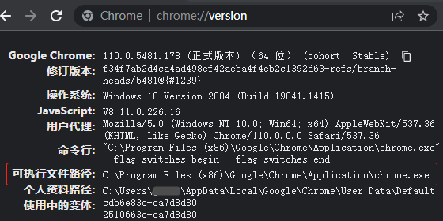

<div class="wwads-cn wwads-horizontal" data-id="317"></div><br/>

在开始之前，我们先进行一些简单设置。

如果只使用收发数据包功能，无需任何准备工作。

如果要控制浏览器，需设置浏览器路径。程序默认设置控制 Chrome，所以下面用 Chrome 演示。如果要使用 Edge 或其它 Chromium 内核浏览器，设置方法是一样的。

:::warning 注意
    作者发现 92 版的 Chrome 存在一些奇怪的问题，导致有些电脑环境下不能启动，请尽量避免使用。
:::

## ✅️️ 执行步骤

### 1️⃣ 尝试启动浏览器

默认状态下，程序会自动在系统内查找 Chrome 路径。

执行以下代码，浏览器启动并且访问了项目文档，说明可直接使用，跳过后面的步骤即可。

```python
from DrissionPage import ChromiumPage

page = ChromiumPage()
page.get('http://DrissionPage.cn')
```

---

### 2️⃣ 设置路径

如果上面的步骤提示出错，说明程序没在系统里找到 Chrome 浏览器。

可用以下其中一种方法设置，设置会持久化记录到默认配置文件，之后程序会使用该设置启动。

:::tip 获取浏览器路径的方法
    - 这里的浏览器路径不一定是 Chrome，Edge 等 Chromium 内核的浏览器都可以。
    - 打开浏览器，在地址栏输入`chrome://version`（Edge 输入`edge://version`），回车。
      
    如图所示，红框中就是要获取的路径。  
    此法不限于 Windows，有界面的 Linux 也是这样取路径。    
:::

**🔸 方法一：**

新建一个临时 py 文件，并输入以下代码，填入您电脑里的 Chrome 浏览器可执行文件路径，然后运行。

```python
from DrissionPage import ChromiumOptions

path = r'D:\Chrome\Chrome.exe'  # 请改为你电脑内Chrome可执行文件路径
ChromiumOptions().set_browser_path(path).save()
```

这段代码会把浏览器路径记录到配置文件，今后启动浏览器皆以新路径为准。

另外，如果是想临时切换浏览器路径以尝试运行和操作是否正常，可以去掉 `.save()`，以如下方式结合第1️⃣步的代码。

```python
from DrissionPage import ChromiumPage, ChromiumOptions

path = r'D:\Chrome\Chrome.exe'  # 请改为你电脑内Chrome可执行文件路径
co = ChromiumOptions().set_browser_path(path)
page = ChromiumPage(co)
page.get('http://DrissionPage.cn')
```

**🔸 方法二：**

在命令行输入以下命令（路径改成自己电脑里的）：

```shell
dp -p D:\Chrome\chrome.exe
```

:::warning 注意
    - 注意命令行的 python 环境与项目应是同一个
    - 注意要先使用 cd 命令定位到项目路径
:::

--- 

### 3️⃣ 重试控制浏览器

现在，请重新执行第1️⃣步的代码，如果正确访问了项目文档，说明已经设置完成。

```python
from DrissionPage import ChromiumPage

page = ChromiumPage()
page.get('http://DrissionPage.cn')
```

--- 

## ✅️️ 说明

当您完成准备工作后，无需关闭浏览器，后面的上手示例可继续使用当前浏览器。
