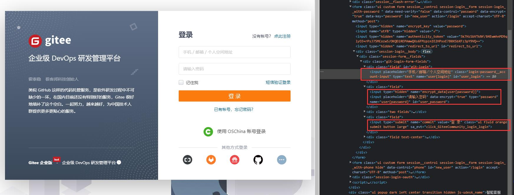

<div class="wwads-cn wwads-horizontal" data-id="317"></div><br/>

现在，我们通过一些例子，来直观感受一下 DrissionPage 的工作方式。

本示例演示使用`ChromiumPage`控制浏览器登录 gitee 网站。

## ✅️️ 页面分析

网址：[https://gitee.com/login](https://gitee.com/login)

打开网址，按`F12`，我们可以看到页面 html 如下：



用户名输入框`id`为`'user_login'`，密码输入框`id`为`'user_password'`，登录按钮`value`为`'登 录'`。

我们可以用这三个属性定位这三个元素，然后对其输入数据和点击。

---

## ✅️️ 示例代码

您可以把以下代码复制到编辑器，把账号和密码改为您自己的，可直接执行看到运行结果。

```python
from DrissionPage import ChromiumPage

# 创建页面对象，并启动或接管浏览器
page = ChromiumPage()
# 跳转到登录页面
page.get('https://gitee.com/login')

# 定位到账号文本框，获取文本框元素
ele = page.ele('#user_login')
# 输入对文本框输入账号
ele.input('您的账号')
# 定位到密码文本框并输入密码
page.ele('#user_password').input('您的密码')
# 点击登录按钮
page.ele('@value=登 录').click()
```

---

## ✅️️ 示例详解

我们逐行解读代码：

```python
from DrissionPage import ChromiumPage
```

↑ 首先，我们导入用于控制浏览器的类`ChromiumPage`。

```python
page = ChromiumPage()
```

↑ 接下来，我们创建一个`ChromiumPage`对象。

```python
page.get('https://gitee.com/login')
```

↑ `get()`方法用于访问参数中的网址。它会等待页面完全加载，再继续执行后面的代码。您也可以修改等待策略，如等待 DOM 加载而不等待资源下载，就停止加载，这将在后面的章节说明。

```python
ele = page.ele('#user_login')
```

↑ `ele()`方法用于查找元素，它返回一个`ChromiumElement`对象，用于操作元素。

`'#user_login'`是定位符文本，`#`意思是按`id`属性查找元素。

值得一提的是，`ele()`内置了等待，如果元素未加载，它会执行等待，直到元素出现或到达时限。默认超时时间 10 秒。

```python
ele.input('您的账号')
```

↑ `input()`方法用于对元素输入文本。

```python
page.ele('#user_password').input('您的密码')
```

↑ 我们也可以进行链式操作，获取元素后直接输入文本。

```python
page.ele('@value=登 录').click()
```

↑ 输入账号密码后，以相同的方法获取按钮元素，并对其执行点击操作。

不同的是，这次通过其`value`属性作为查找条件。`@`表示按属性名查找。

到这里，我们已完成了自动登录 gitee 网站的操作。
