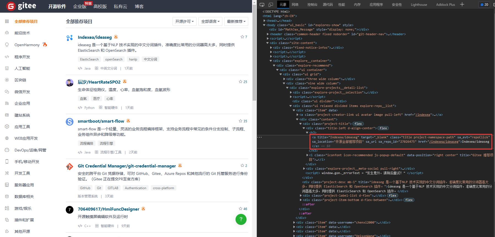

<div class="wwads-cn wwads-horizontal" data-id="317"></div><br/>

本示例演示用`SessionPage`已收发数据包的方式采集 gitee 网站数据。

本示例不使用浏览器。

## ✅️️ 页面分析

网址：[https://gitee.com/explore/all](https://gitee.com/explore/all)

这个示例的目标，要获取所有库的名称和链接，为避免对网站造成压力，我们只采集 3 页。

打开网址，按`F12`，我们可以看到页面 html 如下：



从 html 代码中可以看到，所有开源项目的标题都是`class`属性为`'title project-namespace-path'`的`<a>`元素。我们可以遍历这些`<a>`元素，获取它们的信息。

同时，我们观察到，列表页网址是以页数为参数访问的，如第一页 url 为`https://gitee.com/explore/all?page=1`，页数就是`page`参数。因此我们可以通过修改这个参数访问不同的页面。

---

## ✅️️ 示例代码

以下代码可直接运行并查看结果：

```python
from DrissionPage import SessionPage

# 创建页面对象
page = SessionPage()

# 爬取3页
for i in range(1, 4):
    # 访问某一页的网页
    page.get(f'https://gitee.com/explore/all?page={i}')
    # 获取所有开源库<a>元素列表
    links = page.eles('.title project-namespace-path')
    # 遍历所有<a>元素
    for link in links:
        # 打印链接信息
        print(link.text, link.link)
```

**输出：**

```shell
小熊派开源社区/BearPi-HM_Nano https://gitee.com/bearpi/bearpi-hm_nano
明月心/PaddleSegSharp https://gitee.com/raoyutian/PaddleSegSharp
RockChin/QChatGPT https://gitee.com/RockChin/QChatGPT
TopIAM/eiam https://gitee.com/topiam/eiam

以下省略。。。
```

---

## ✅️️ 示例详解

我们逐行解读代码：

```python
from DrissionPage import SessionPage
```

↑ 首先，我们导入用于收发数据包的页面类`SessionPage`。

```python
page = SessionPage()
```

↑ 接下来，我们创建一个`SessionPage`对象。

```python
for i in ranage(1, 4):
    page.get(f'https://gitee.com/explore/all?page={i}')
```

↑ 然后我们循环 3 次，以构造每页的 url，每次都用`get()`方法访问该页网址。

```python
    links = page.eles('.title project-namespace-path')
```

↑ 访问网址后，我们用页面对象的`eles()`获取页面中所有`class`属性为`'title project-namespace-path'`的元素对象。

`eles()`方法用于查找多个符合条件的元素，返回由它们组成的`list`。

这里查找的条件是`class`属性，`.`表示按`class`属性查找元素。

```python
    for link in links:
        print(link.text, link.link)
```

↑ 最后，我们遍历获取到的元素列表，获取每个元素的属性并打印出来。

`.text`获取元素的文本，`.link`获取元素的`href`或`src`属性。
